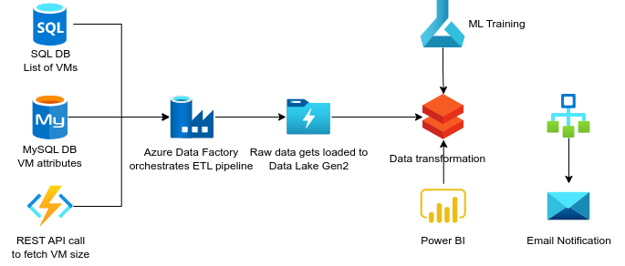

# Azure Virtual Machine Audit
## 1. Introduction
### 1.1 Overview
The Azure Virtual Machine Audit project is a modernized data pipeline that utilizes various Azure services to perform auditing tasks on virtual machines. This README.md file provides an overview of the project, its logical architecture, and the components involved.

The data pipeline makes use of the following Azure services:
- Azure Data Factory
- Azure Databricks
- Azure Functions
- Azure Data Lake

## 2. Logical Architecture
### 2.1 Logical System Component Overview
The logical architecture of the Azure Virtual Machine Audit project is illustrated in the following diagram:

The diagram represents the various system components and their interactions within the data pipeline. Each component plays a specific role in the auditing process.

Here's a brief description of each component:

- **Azure Data Factory**: This service is responsible for orchestrating and scheduling data movement and data transformation activities. It acts as the central hub for managing and monitoring the entire data pipeline.

- **Azure Databricks**: Databricks is used for big data processing and analytics. It provides a collaborative environment for running Apache Spark-based workloads, allowing for efficient data transformations, analytics, and machine learning tasks.

- **Azure Functions**: Azure Functions are serverless compute resources that can execute small pieces of code or functions in response to events or triggers. In the Azure Virtual Machine Audit project, Azure Functions are used for executing specific tasks, such as triggering audits based on predefined events or performing data validations.

- **Azure Data Lake**: This is a scalable and secure storage solution that allows you to store and analyze large amounts of unstructured and structured data. In the context of this project, Azure Data Lake is used for storing the audit logs, virtual machine data, and other relevant information.

These components work together to create a comprehensive and efficient data pipeline for auditing virtual machines in Azure.
