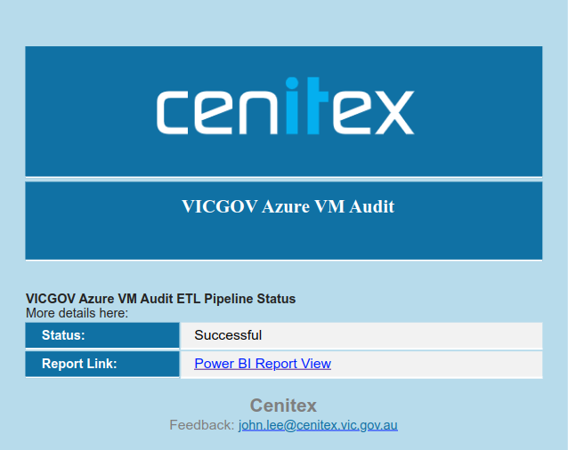
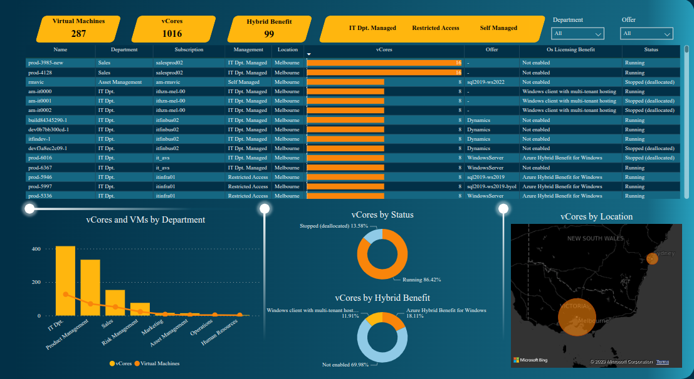
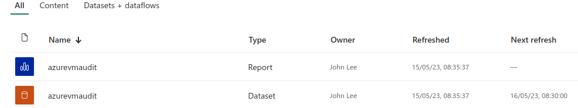

# Azure Virtual Machine Audit
## 1. Introduction
### 1.1 Overview
The Azure Virtual Machine Audit project is a modernized data pipeline that utilizes various Azure services to perform auditing tasks on virtual machines. This README.md file provides an overview of the project, its logical architecture, and the components involved.

The data pipeline makes use of the following Azure services:
- Azure Data Factory
- Azure Databricks
- Azure Functions
- Azure Data Lake

## 2. Logical Architecture
### 2.1 Logical System Component Overview
The logical architecture of the Azure Virtual Machine Audit project is illustrated in the following diagram:

The diagram represents the various system components and their interactions within the data pipeline. Each component plays a specific role in the auditing process.

Here's a brief description of each component:

- **Azure Data Factory**: This service is responsible for orchestrating and scheduling data movement and data transformation activities. It acts as the central hub for managing and monitoring the entire data pipeline.

- **Azure Databricks**: Databricks is used for big data processing and analytics. It provides a collaborative environment for running Apache Spark-based workloads, allowing for efficient data transformations, analytics, and machine learning tasks.

- **Azure Functions**: Azure Functions are serverless compute resources that can execute small pieces of code or functions in response to events or triggers. In the Azure Virtual Machine Audit project, Azure Functions are used for executing specific tasks, such as triggering audits based on predefined events or performing data validations.

- **Azure Data Lake**: This is a scalable and secure storage solution that allows you to store and analyze large amounts of unstructured and structured data. In the context of this project, Azure Data Lake is used for storing the audit logs, virtual machine data, and other relevant information.

These components work together to create a comprehensive and efficient data pipeline for auditing virtual machines in Azure.

### 2.2 Email Notification Component
#### Overview
The Email Notification Component is a function that is invoked at the end of an ETL (Extract, Transform, Load) pipeline. Its purpose is to trigger a Logic App for sending email notifications.

#### Functionality
The function performs the following tasks:

- **Triggers a Logic App**: The function is responsible for initiating a Logic App that handles the email notification process.
- **Sends Email Notifications**: Once the Logic App is triggered, it takes care of sending email notifications with csv file attached based on the configured logic and templates.

#### Usage
To use the Email Notification Component in your ETL pipeline, follow these steps:

- **Prerequisites**: Ensure that you have the following prerequisites set up: Access to the ETL pipeline where the function will be invoked.
A configured Logic App that handles the email notification process.

- **Integration**: Integrate the Email Notification Component into your ETL pipeline: Include the function in your pipeline's code or script.
Ensure that the function is invoked at the end of the pipeline, after the ETL process is completed.
- **Configuration**: Configure the Email Notification Component: Provide the necessary parameters or inputs required by the function.
Set up the Logic App's endpoint or trigger information so that the function can invoke it correctly.
- **Testing**: Test the integration and functionality of the Email Notification Component: Run ETL pipeline and verify that the function is invoked successfully. Check the Logic App's execution history and email notifications to ensure they are sent as expected.

### 2.3 Power BI Dashboard Overview

The Power BI Dashboard is an interactive visualization tool that presents the final processed data from the Azure Data ETL pipeline. It enables users to explore, analyze, and gain valuable insights from the data. The dashboard is designed to provide a user-friendly interface with intuitive visuals, allowing stakeholders to make informed decisions based on the data.

The Power BI Dashboard is refreshed daily to ensure the information presented is up-to-date. The data is automatically loaded from the Azure Data ETL pipeline into the Power BI workspace, where it is transformed into meaningful visualizations.